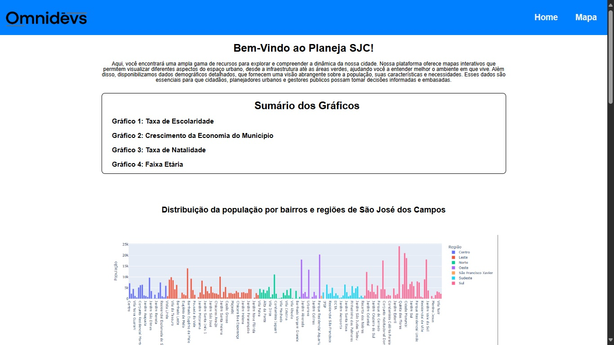
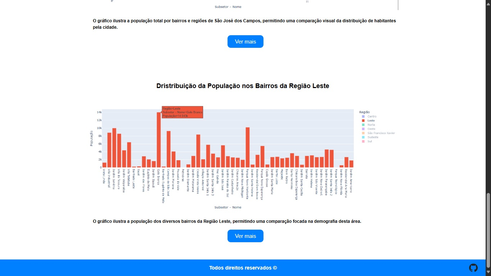

# MVP – Protótipo do Projeto

## API – Análise do Censo 2022 em São José dos Campos

<p align="center">
  <a href ="#-Objetivo-do-MVP"> Objetivo </a>  |
  <a href ="#-Funcionalidades-do-MVP"> Funcionalidades do MVP </a>  |
  <a href ="#-Demonstração"> Demonstração </a>  |
  <a href ="#-Próximos-passos-do-MVP"> Próximos passos do MVP </a> |
  <a href ="#-como-executar-o-projeto"> Como Executar o Projeto </a> |
  <a href ="#-conheça-a-equipe-talentosa-por-trás-do-projeto"> Equipe </a> |
</p>
    
---

## 🚀 Objetivo do MVP

O MVP entregue nesta fase tem como objetivo validar a proposta inicial do projeto: disponibilizar visualizações simples dos dados do Censo 2022 em São José dos Campos.

- Mostrar que a proposta do painel interativo é viável;

- Permitir que o usuário já visualize gráficos com dados reais;

---

## ✅ Funcionalidades do MVP

### Funcionalidades já entregues:

- Visualização dos principais gráficos do censo de SJC em 2022 e 2010;

- Gráfico da População total por bairro e zona;

- Exibição de pirâmide etária básica;

- Amostra da Densidade populacional por região;

- Visão sobre o Crescimento populacional por zona;

- Estrutura de frontend em HTML + CSS (com responsividade básica);

- Backend inicial no Google Colab para processar os dados.

---

## 🎨 Demonstração

<div align="center">  </div>
<div align="center">  </div>

---

## 🔮 Próximos passos do MVP

- Adicionar filtros por região e faixa etária;

- Incluir gráficos comparativos de evolução populacional (2000, 2010 e 2022);

- Implementar mapas interativos para visualização dos gráficos;

- Melhorar a experiência do usuário (UX) com design mais intuitivo e agradável.

---

## 📜 Como executar e visualizar o projeto:

<!-- Instalações e parte introdutória do projeto -->
### 1. Clonar o Repositório Principal:
```
# Baixa o código do projeto que está no GitHub para sua máquina
git clone https://github.com/OmniDevsOficial/API-Censo-2022.git

# Entra na pasta do projeto que foi clonada
cd API-Censo-2022
```

<!-- Primeira parte do Front-End -->
### 2. Configuração do Front-End:
```
# Adentra na pasta responsável pelo Front-End
cd Frontend

# inicia o Front-End localmente em sua máquina
start index.html
```

<!-- Configura o Back-End -->
### 3. Configuração do Back-End:
```
# Copie e cole em seu navegador o site onde está hospedado o projeto
https://colab.research.google.com/github/OmniDevsOficial/API-Censo-2022/blob/main/Backend/PlanejaSJC.ipynb
```

<!-- Configura o Back-End -->
### 4. Clone o repositório do Colab:
```
- Vá em "ARQUIVO" no canto superior esquerdo
- Clique em "Salvar uma cópia no Drive"

** Caso não abra o arquivo automáticamente após salvar uma cópia
- Clique em "ARQUIVO" novamente
- Abrir notebook
- Localize o arquivo e clique nele
```

---

## 🎓 Conheça a equipe talentosa por trás do projeto

| Foto | Nome | Função | Github | Linkedin |
| :---------: | :---------: | :---------------------: | :-----------------: | :-------: |
|  | *Yoseph Levi* | Product Owner | <a href="https://github.com/YosephLima"></a> | <a href="https://www.linkedin.com/in/leonardo-borges-/"></a> 
|  | *Luis Guilherme* | Scrum Master | <a href="https://github.com/Mactravish552"></a> | <a href="not_found"></a> |
|  | *Gabriela Santos* | Desenvolvedor | <a href="https://github.com/GabSantt"></a> | <a href="not_found"></a> | 
|  | *Henrique Moreira* | Desenvolvedor | <a href="https://github.com/DeveloperCorsair"></a> | <a href="https://www.linkedin.com/in/henriquemm/"></a> 
|  | *Jaqueline Moreira* | Desenvolvedor | <a href="https://github.com/Jayyliix15"></a> | <a href="not_found"> </a> |
|  | *Kathelyn Cauane* | Desenvolvedor | <a href="https://github.com/KathelynZanin"></a> | <a href="not_found"></a> |
|  | *Marcio Gustavo* | Desenvolvedor | <a href="https://github.com/Marcio-gustavoI"></a> | <a href="not_found"></a> | 
|  | *Matheus Bueno* | Desenvolvedor | <a href="https://github.com/Matheusxfc"></a> | <a href="not_found"></a>